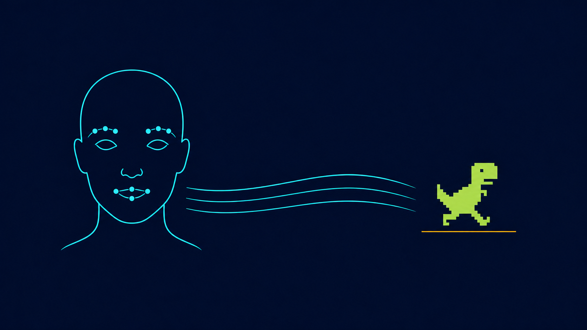
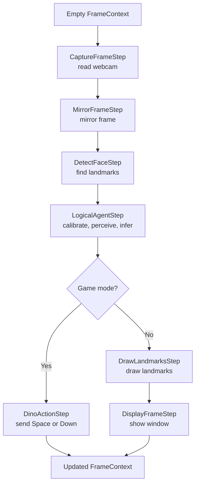

<div align="center">
  

  # DinoExpression

  **Control Chrome Dino with facial expressions, computer vision, and an explainable logical agent.**

  [Overview](#overview) · [How it works](#how-it-works) · [Architecture](#architecture) · [Quick start](#quick-start) · [Rules](#agent-rules)
</div>

---

## Overview

**DinoExpression** turns facial expressions into Chrome Dino commands. The webcam detects facial landmarks, measures mouth opening and eyebrow elevation, then sends those perceptions to a knowledge-based agent.

The decision is made from declarative rules stored in JSON—not an opaque model. That makes every decision inspectable: which expression was detected, which facts were sent to the agent, and why it chose to jump, duck, or remain neutral.

| Expression | Perceived fact | Game action |
| --- | --- | --- |
| Open mouth | `boca_aberta` | Duck |
| Closed mouth + raised eyebrows | `boca_fechada` + `sobrancelhas_levantadas` | Jump |
| Closed mouth + neutral eyebrows | `boca_fechada` + `sobrancelhas_nao_levantadas` | Neutral |


## Results


## How it works

Every webcam frame goes through perception, normalization, inference, and actuation.


### Facial perception

MediaPipe Face Mesh supplies 468 landmarks. DinoExpression uses only the points needed for interaction:

- **Mouth:** the distance between landmarks `13` and `14`.
- **Scale:** the outer eye corners, `33` and `263`.
- **Eyebrows:** the vertical gap between eyebrow and eye landmarks on both sides of the face.

Measurements are divided by the eye-corner distance, so moving closer to or farther from the camera does not artificially change a decision.

### Calibration and jump detection

For the first **24 valid frames**, keep a neutral face. The agent uses the median mouth and eyebrow measurements as that user's baseline.

```text
mouth opening     = distance(lower lip, upper lip) / eye-corner distance
eyebrow elevation = current eyebrow gap - baseline eyebrow gap
```

With a closed mouth, when **both eyebrows** pass the configured threshold, the agent infers `acao:pular` (jump). The result must persist for **3 consecutive frames** before it reaches the game, reducing noise-driven false positives.

Once calibration ends, the game waits for two seconds. The first jump starts the run; later jumps press `Space`. An open mouth holds `Down`; returning to neutral releases the key.

## The logical agent

The controller is a **knowledge-based agent**. It does not turn pixels directly into keystrokes: it turns perception into propositions and reasons over them.

```text
Perception: closed mouth, raised eyebrows
TELL:       {boca_fechada, sobrancelhas_levantadas}
Rule:       boca_fechada AND sobrancelhas_levantadas -> acao:pular
ASK:        acao:pular
```

The knowledge base runs forward chaining until it reaches a fixed point. For every valid perceptual combination, it must derive **exactly one** action. Ambiguous or incomplete rules, invalid JSON, and invalid thresholds prevent startup.

| Layer | Responsibility |
| --- | --- |
| Perception | Extract geometric measurements from facial landmarks. |
| Knowledge | Define facts, thresholds, and rules without editing Python code. |
| Actuation | Convert a semantic action into Chrome keystrokes. |

See [docs/logical_agent_rules.md](docs/logical_agent_rules.md) for the full model description.

## Architecture

### Chain of Responsibility

Frame processing follows the **Chain of Responsibility** principle: each step receives the same `FrameContext`, handles one concern, updates the context, and passes it to the next step. `Pipeline` orchestrates that chain.



Every step exposes `process(context)`. The resulting responsibilities stay small and isolated: capture can change without changing inference, and a new display mode does not need to know the agent rules.

### Repository layout

```text
.
├── main.py                 # entry point and chain composition
├── pipeline.py             # FrameContext and chain orchestrator
├── logic.py                # knowledge base and inference
├── knowledge/
│   └── dino_rules.json     # declarative thresholds and rules
├── steps/
│   ├── camera.py           # capture and mirroring
│   ├── face.py             # Face Mesh, calibration, logical agent
│   ├── action.py           # Chrome Dino keystrokes
│   └── display.py          # drawing and debug display
├── utils/chrome.py         # Chrome launch and focus helpers
└── assets/                 # README artwork
```

## Quick start

### Requirements

- Python 3.12
- A working webcam
- Google Chrome (only for game control)
- [uv](https://docs.astral.sh/uv/)

### Install

```powershell
git clone <YOUR_REPOSITORY_URL>
cd DinoExpression
uv sync
```

### Run

Preview landmarks and the inferred action without controlling the game:

```powershell
uv run python main.py
```

Launch Chrome Dino and control it with your face:

```powershell
uv run python main.py --game-control
```

Show measurements, `TELL` facts, the `ASK` result, and per-step timing:

```powershell
uv run python main.py --game-control --debug-mode
```

Press `q` or `Esc` to close preview mode. In game mode without debugging, stop with `Ctrl+C`.

## Options

| Option | Description |
| --- | --- |
| `--camera N` | Select the camera index; default: `0`. |
| `--game-control` | Open `chrome://dino/` and send game commands. |
| `--debug-mode` | Show landmarks, measurements, `TELL`, `ASK`, and timing; requires `--game-control`. |
| `--show-logic-points` | Highlight the landmarks used by the logical agent in preview mode. |
| `--rules file.json` | Load an alternative knowledge base. |
| `--chrome-path path\to\chrome.exe` | Set the Chrome path manually. |

Example using a second camera and custom rules:

```powershell
uv run python main.py --camera 1 --game-control --rules .\knowledge\dino_rules.json
```

## Agent rules

Rules live in [knowledge/dino_rules.json](knowledge/dino_rules.json) and can be adjusted without changing Python code:

```json
{
  "mouth_threshold": 0.08,
  "brow_threshold": 0.02,
  "rules": [
    { "if": ["boca_aberta"], "then": "acao:abaixar" },
    {
      "if": ["boca_fechada", "sobrancelhas_levantadas"],
      "then": "acao:pular"
    },
    {
      "if": ["boca_fechada", "sobrancelhas_nao_levantadas"],
      "then": "acao:neutro"
    }
  ]
}
```

`boca_aberta` has practical priority because the jump and neutral rules require `boca_fechada`. Whenever rules change, the loader validates all four possible perceptual combinations before the camera or Chrome opens.

## References

- Stuart Russell and Peter Norvig, [*Artificial Intelligence: A Modern Approach*, Chapter 7](https://aima.cs.berkeley.edu/2nd-ed/newchap07.pdf).
- [MediaPipe Face Mesh](https://ai.google.dev/edge/mediapipe/solutions/vision/face_landmarker).

---

<div align="center">
  Built to explore computer vision, knowledge-based agents, and hands-free interaction.
</div>
